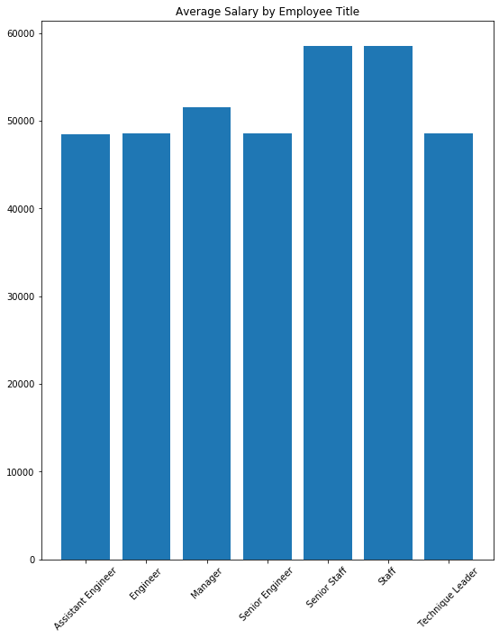

# SQL-challenge

## Table of Contents

1) Diagram of schema (.png)
1) Table schemata SQL 
1) Queries SQL 
1) Employee salary on SQL Alchemy (.py)
1) Employee salary on SQL Alchemy (.ipynb)
1) Average Salary by Title Plot (.png)

## Analysis of Employee Salaries using SQL Alchemy

The task requires salaries to be aggregated by title. First, it is necessary to inspect the CSV files for 'salaries' and the 'titles' before the join and group by commands are issued. 

### Limitations
Upon inspecting the CSVs, the 'titles' table has 443,308 rows whereas the 'salaries' table has 300,024. Performing an inner join would drop more than 140,000 unique entries; however, the 'titles' table includes repeat employee number entries with different titles which denotes a promotion or change of title.

Moreover, the 'salaries' table presents an issue. Although the 'titles' table includes current employees, the 'salaries' table does not include salary data for employees working past the year 2001; it contains no current salary data.

--------------------------
Try this query to see:

select emp_no, to_date

from salaries

where (extract (year from (to_date))) = 2001;

--------------------------

### Average Salary Grouped by Title

#### Titles
Senior Engineer, Assistant Engineer, Engineer, Manager, Technique Leader, Senior Staff, Staff

#### DataFrame of Average Salary by Employee Title
title                       average_salary
0  Assistant Engineer        48493.20
1            Engineer        48539.78
2             Manager        51531.04
3     Senior Engineer        48506.75
4        Senior Staff        58503.29
5               Staff        58465.27
6    Technique Leader        48580.51

#### Bar Chart of Average Salary by Employee Title

