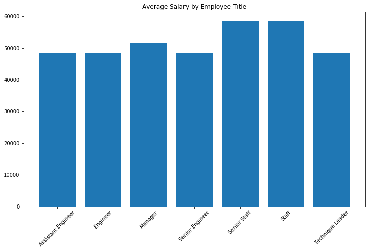

# Employee-Database-SQL

## Table of Contents

1) ERD of schema (.png)
1) Table schemata SQL (.sql)
1) Queries SQL (.sql)
1) Employee salary on SQL Alchemy (.py)
1) Employee salary on SQL Alchemy (.ipynb)
1) Average Salary by Title Data Frame (.png)
1) Average Salary by Title Plot (.png)

## Analysis of Employee Salaries using SQL Alchemy

The task requires salaries to be aggregated by title. First, it is necessary to inspect the CSV files for 'salaries' and the 'titles' before the join and group by commands are issued. 

### Limitations
Upon inspecting the CSVs, the 'titles' table has 443,308 rows whereas the 'salaries' table has 300,024. Performing an inner join would drop more than 140,000 unique entries; however, the 'titles' table includes repeat employee number entries with different titles which denotes a promotion or change of title.

Moreover, the 'salaries' table presents an issue. Although the 'titles' table includes current employees, the 'salaries' table does not include salary data for employees working past the year 2001; it contains no current salary data.

--------------------------
Try this query to see:

select emp_no, to_date

from salaries

where (extract (year from (to_date))) = 2001;

--------------------------

### Average Salary Grouped by Title

#### Titles
Senior Engineer, Assistant Engineer, Engineer, Manager, Technique Leader, Senior Staff, Staff

#### Data Frame of Average Salary by Employee Title

#### Bar Chart of Average Salary by Employee Title

--------------------------
### Findings
Comparing average salaries per title, the data immediately looks erroneous. An assistant engineer, an engineer, a senior engineer, and a technique leader should not be earning nearly the same salaries because of their places in the professional hierarchy. Similarly, a staff member should not be earning the same as a senior staff member. Based on the hierarchy of titles and the size of the company, the average salaries for superior or senior roles should be substantially greater than junior or subordinate roles.
