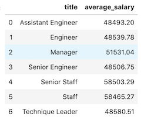
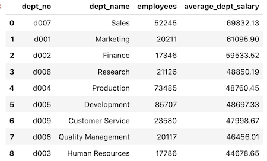

# Employee Database SQL

## Finding 'Dirty' Data across Employee Databases using SQL Alchemy

The objective is to identify discrepancies spanning multiple related databases by using joins, queries, and aggregation. 

## Method
1) Do a cursory inspection of the CSV files before the JOIN and GROUP BY commands are issued.
2) With **SQL**, [create empty tables](table_schemata.sql) then fill in the data using the csv files.
3) Perform [queries](sql-queries.sql), specifically INNER JOIN between 'salaries' and 'titles' using employee ID as the shared index.
4) Do the same with the rest of the tables using the same shared index.
5) Run SQL Queries on **Python** using [SQLAlchemy](sqlalchemy_queries.py) and transform the query results into data frames in **Pandas**.
6) Visualize the query results by using the data frames to generate charts using **Matplotlib**.

### Assessments
1) The 'titles' table has 443,308 rows whereas the 'salaries' table has 300,024. The 'titles' table includes repeat employee number entries with different titles which indicates promotions or changes of title.

2) The 'salaries' table does not include salary data for employees working past the year 2001; it contains no current salary data.

3) When performing an INNER JOIN on the departments, dept_emp, employees, and salaries tables, the dates do NOT match up. Specifically, the 'from_date' in the department employee ('dept_emp') table is not the same as the 'from_date' in the salaries table.

4) The 'from_dates' match between the 'dept_emp' and 'titles' tables.

5) The 'salaries' table contains 245,736 rows whose 'hire_dates' do not match with the 'from_dates' in the 'dept_emp' and 'titles' tables.

6) There are 323,161 employees with mismatched final dates of employment ('to_date') between the 'department employee' and 'salaries' tables.

### Average Salary Grouped by Title

Comparing average salaries per title, the data immediately looks erroneous. An assistant engineer, an engineer, a senior engineer, and a technique leader should not be earning nearly the same salaries because of their places in the professional hierarchy. Similarly, a staff member should not be earning the same as a senior staff member. Based on the hierarchy of titles and the size of the company, the average salaries for superior or senior roles should be substantially greater than junior or subordinate roles.

### Average Salary per Department

Although the 'salaries' table is not updated, the budget allocation for department salaries appears sound. 

